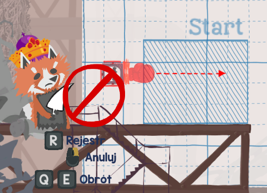
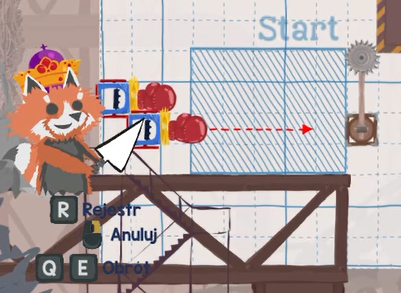

# LetMeSpawnCamp

A BepInEx mod for Ultimate Chicken Horse that allows the attack range of traps (such as the Boxing Glove and Wrecking Ball) to overlap with the spawn zone.

In the vanilla game, players are prevented from placing any hazard whose use range intersects with the spawn protection area. This mod removes that restriction specifically for non-solid trap ranges, while preserving the original restriction that prevents placing full solid blocks directly onto the spawn point.

## Features

### Vanilla Behavior (Before)
The game blocks you from placing hazards if their range touches the spawn zone.

### Modded Behavior (After)
You can place traps so their range reaches directly into the spawn zone.

